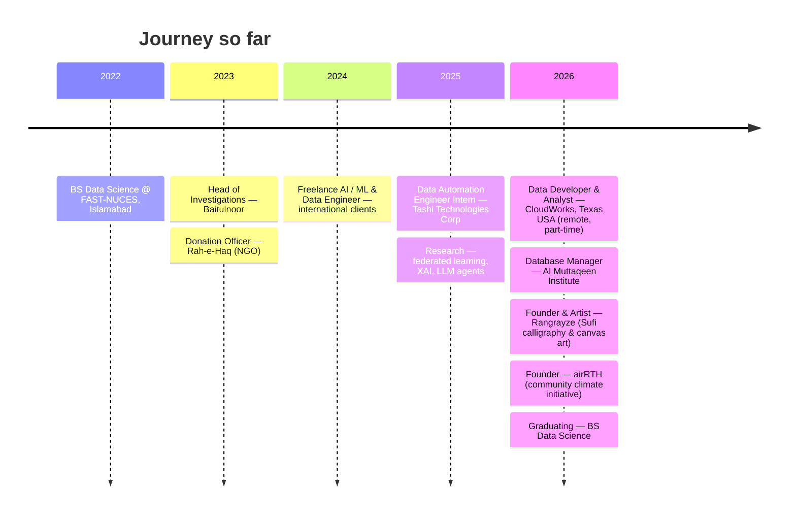

<!-- ══════════════════ ANIMATED HEADER ══════════════════ -->
<div align="center">


<!-- ── Typing animation ── -->
<a href="https://linkedin.com/in/laiba-mazhar">
  
</a>

<br/>

<!-- ── Social / contact ── -->
<a href="https://linkedin.com/in/laiba-mazhar"></a>
<a href="mailto:laibamazhar.000@gmail.com"></a>
<a href="https://github.com/laiba-mazhar?tab=repositories"></a>


<br/><br/>


</div>


<!-- ══════════════════ ABOUT ══════════════════ -->

##  &nbsp;About Me

```python
class LaibaMazhar:
    role      = "Data Developer & Analyst @ CloudWorks (Texas, USA · remote)"
    also      = "AI / ML Engineer · Data Scientist · Researcher"
    education = "BS Data Science, FAST-NUCES ('22 → '26)"
    based_in  = "Lahore, Pakistan  🌍  working remote"

    focus = [
        "LLM agents · RAG · prompt engineering",
        "Adversarial ML & federated-learning security",
        "Explainable AI (SHAP) · intrusion detection",
        "Batch + streaming data platforms at scale",
    ]

    stack = {
        "ml":   ["PyTorch", "TensorFlow", "scikit-learn", "XGBoost"],
        "llm":  ["LangChain", "Hugging Face", "OpenAI", "Groq"],
        "data": ["Spark", "Kafka", "Airflow", "Databricks", "dbt"],
        "eng":  ["Python", "SQL", "TypeScript", "FastAPI", "Docker"],
    }

    def currently(self) -> str:
        return "Building data products at CloudWorks & writing the FYP 🚀"
```

- 💼 &nbsp;**Currently** part-time **Data Developer & Analyst** at **CloudWorks** (Texas, USA — remote), building data pipelines, models and analytics
- 🔬 &nbsp;**Researching** adversarial robustness in federated learning, explainable IDS, and hallucination mitigation in multi-agent LLM systems
- 🤖 &nbsp;**Building** production RAG pipelines, autonomous agents, and end-to-end ML services
- 🏗️ &nbsp;**Engineering** batch & real-time data platforms with Spark, Kafka and Airflow
- 🎨 &nbsp;**Founder & artist** at **Rangrayze**, an art gallery for Sufi-inspired calligraphy and canvas work
- 🌱 &nbsp;**Founder** of **airRTH**, a community climate initiative running sustainability campaigns and environmental programs
- 🏆 &nbsp;**Winner** — Big Data Quest Hackathon, DataFest / NaSCon
- 🎓 &nbsp;Stanford University *Machine Learning* (Coursera, Andrew Ng)
- 🗣️ &nbsp;English (fluent) · Urdu (native) · German & Arabic (basic)
- 📫 &nbsp;Reach me at **laibamazhar.000@gmail.com**


<!-- ══════════════════ TECH STACK ══════════════════ -->

##  &nbsp;Tech Stack

<div align="center">

**🧠 &nbsp;AI · ML · LLMs**


<br/>


<br/><br/>

**⚙️ &nbsp;Data Engineering · Big Data**


<br/>


<br/><br/>

**💻 &nbsp;Languages · Backend · Cloud**


<br/><br/>

**📊 &nbsp;Analytics & BI**


</div>


<!-- ══════════════════ RESEARCH ══════════════════ -->

##  &nbsp;Research

| 📄 Work | Focus | Headline Result |
|:--|:--|:--|
| **[ICS — Adversarial Poisoning Defense in Federated Learning](https://github.com/laiba-mazhar/ICS-Federated-Learning-Adversarial-Defense)** | Independent Class-wise Coherence Score against label-flipping & backdoor attacks, using MI-FGSM adversarial probing | **75.02%** accuracy at **19.75%** ASR on MNIST — beats global-coherence baselines by **5–7%** accuracy with **30–40%** lower ASR across 15 clients |
| **[Explainable Multiclass Intrusion Detection](https://github.com/laiba-mazhar/Explainable-XGBoost-Intrusion-Detection-RESEARCH_PAPER)** | XGBoost + TreeSHAP with a severity-scoring engine for SOC deployment (NSL-KDD, UNSW-NB15) | **99.90%** avg accuracy, **+12.28%** macro-F1 over a Random Forest baseline, **2.44×** stability gain over 5 seeds |
| **LLM-Driven Autonomous Trading Agents** | Analyst → Critic → Decision pipeline on Llama-3.3-70B (Groq) for hallucination mitigation in financial reasoning | **80%** recommendation-adjustment rate and **HDR 1.0** across AAPL, MSFT, TSLA, GOOGL, AMZN |


<!-- ══════════════════ PROJECTS ══════════════════ -->

##  &nbsp;Featured Projects

<table>
<tr>
<td width="50%" valign="top">

### 🤖 [LaunchMind](https://github.com/laiba-mazhar/launchmind-laiba)


A multi-agent system that runs a micro-startup end to end — idea → GitHub PR → Slack launch post → cold outreach email, with no human in the loop.

</td>
<td width="50%" valign="top">

### 🎓 [Maktab — Academy Management](https://github.com/laiba-mazhar/academy-management-system)


Full-stack school platform: React + Vite + TypeScript on Supabase (Postgres/Auth/RLS) — students, staff, timetable, attendance, fees, exams and dashboards.

</td>
</tr>
<tr>
<td width="50%" valign="top">

### 🛡️ [Explainable XGBoost IDS](https://github.com/laiba-mazhar/Explainable-XGBoost-Intrusion-Detection-RESEARCH_PAPER)


Robust, explainable multiclass intrusion detection with TreeSHAP, multi-seed evaluation and severity-aware alert scoring built for real SOC workflows.

</td>
<td width="50%" valign="top">

### 🔐 [ICS — Federated Learning Defense](https://github.com/laiba-mazhar/ICS-Federated-Learning-Adversarial-Defense)


Class-wise coherence scoring to detect and suppress adversarial data poisoning across distributed federated-learning clients.

</td>
</tr>
<tr>
<td width="50%" valign="top">

### 🌐 [English → Urdu Translation](https://github.com/laiba-mazhar/Transformer-English-Urdu-Machine-Translation)


Transformer built from scratch vs. an LSTM/Bahdanau-attention seq2seq baseline on UMC005, with BPE tokenization and BLEU/ROUGE evaluation.

</td>
<td width="50%" valign="top">

### ✍️ [Handwriting Analysis WebApp](https://github.com/laiba-mazhar/AI-Based-Handwriting-Analysis-and-Author-Identification-WebApp)


OCR + ML + NLP Flask app for author identification, sentiment and emotion analysis, grammar checking and plagiarism detection, served over REST APIs.

</td>
</tr>
</table>

<details>
<summary><b>🗂️ &nbsp;More projects — click to expand</b></summary>

<br/>

| Project | Stack | What it does |
|:--|:--|:--|
| [**Comprehensive Data Pipeline with Apache Airflow**](https://github.com/laiba-mazhar/Comprehensive-Data-Pipeline-with-Apache-Airflow) | Airflow · Pandas · Matplotlib | DAG-orchestrated ETL and analysis over the Brazilian e-commerce dataset |
| [**Bagging vs Boosting — Breast Cancer Classification**](https://github.com/laiba-mazhar/Bagging-vs-Boosting-Breast-Cancer-Classification) | scikit-learn | Head-to-head of Decision Tree, Bagging, AdaBoost and Random Forest |
| [**E-commerce Retail Trends & Impact Analysis**](https://github.com/laiba-mazhar/E-commerce-Retail-Trends-Impact-Analysis) | Python · Pandas | CLV modelling and what-if pricing analysis on global retail data |
| [**Iran Airline Analysis**](https://github.com/laiba-mazhar/IranAirlineAnalysis-Tableau) | Tableau | 9 sheets and 3 dashboards on air-quality and seasonal trends |
| [**Console Guitar System**](https://github.com/laiba-mazhar/Console-Guitar-System-AI) | C++ · GUI | Guitar-learning app with user management and a game environment |
| [**NumPy & Pandas Basics**](https://github.com/laiba-mazhar/Numpy-Pandas-basics) | Jupyter | Teaching notebooks for the data-wrangling fundamentals |

</details>


<!-- ══════════════════ EXPERIENCE ══════════════════ -->

##  &nbsp;Experience




<!-- ══════════════════ STATS ══════════════════ -->

##  &nbsp;GitHub Stats

<div align="center">


<br/><br/>


<br/><br/>

<!-- Self-hosted copy, regenerated daily by .github/workflows/snake.yml with its
     dash/blink animations patched to loop instead of running once. -->


</div>


<!-- ══════════════════ SNAKE ══════════════════ -->

<div align="center">

### 🐍 &nbsp;Watch my contributions get eaten

<picture>
  <source media="(prefers-color-scheme: dark)" srcset="https://raw.githubusercontent.com/laiba-mazhar/laiba-mazhar/output/snake-dark.svg"/>
  <source media="(prefers-color-scheme: light)" srcset="https://raw.githubusercontent.com/laiba-mazhar/laiba-mazhar/output/snake.svg"/>
  
</picture>

</div>


<!-- ══════════════════ ACHIEVEMENTS ══════════════════ -->

##  &nbsp;Achievements

<div align="center">


</div>


<!-- ══════════════════ FOOTER ══════════════════ -->

<div align="center">

### 💬 &nbsp;Let's build something

<a href="mailto:laibamazhar.000@gmail.com"></a>
<a href="https://linkedin.com/in/laiba-mazhar"></a>

<br/><br/>


</div>
